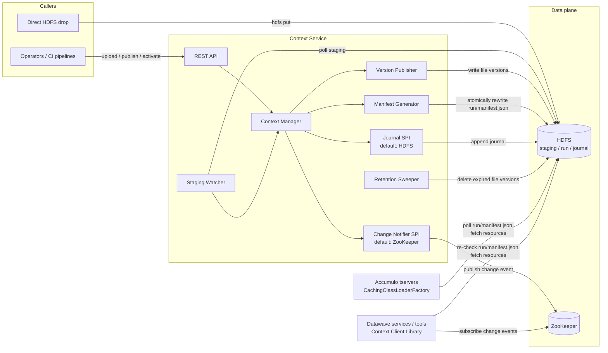

# Context Service — High-Level Design

**Status:** Draft for review
**Repo:** `datawave-file-provider-service` (the service described here is referred to as the *Context Service*)
**Related:** [Accumulo classloaders][accumulo-classloaders], [Datawave Spring Boot starter][datawave-starter], [design prompt](hld-prompt.md), [per-file versioning notes](per-file-versioning-notes.md)

---

## 1. Purpose

The Context Service manages **Accumulo classloader contexts**: named compositions of independently versioned files — JARs and raw configuration files alike — stored in HDFS and consumed by Accumulo's `CachingClassLoaderFactory` ([accumulo-classloaders][accumulo-classloaders]) and by this service's client library (§6). It provides:

- **Context management and awareness** — which contexts exist, what files they contain, and which version of each file is current.
- **Auto-detection of new files** — files uploaded to a context are detected, versioned, and rolled into the context without manual manifest editing.
- **Context composition management** — the Accumulo manifest the classloader polls is the authoritative record of each context's current file→version composition; the service maintains it with atomic updates and publishes **file-named change notifications** (SPI-driven, ZooKeeper by default) after each update.
- **An observable audit trail** — every context change is recorded in a durable, append-only journal in HDFS (SPI-driven) and exposed via the REST API.
- **Client-side consumption** — a client library for non-tserver JVMs that keeps a per-context local snapshot current (a ZooKeeper change notification triggers an immediate manifest re-check) and lets callers resolve resource streams and memoized derived objects directly from the shared local file cache — no classloader in that path — plus a context classloader for callers that actually load classes, with per-file change callbacks (§6).

### 1.1 Background: how the Accumulo classloader consumes a context

The design is driven by the contract of `CachingClassLoaderFactory` (the current, supported implementation in [accumulo-classloaders][accumulo-classloaders]; the older VFS/reloading classloader was removed upstream):

- A context, from Accumulo's point of view, **is a URL to a JSON manifest** (`table.class.loader.context=<manifest URL>`). The manifest lists resources, each with a `location` URL, a digest `algorithm`, and a `checksum`, plus a `monitorIntervalSeconds`.
- Resources are **not required to be JARs**. Nothing in the manifest or its download layer validates file type — every resource is downloaded, checksum-verified, and cached as raw bytes. JAR-ness matters only for *classloader visibility*: a non-JAR entry on the resulting `URLClassLoader` classpath is silently inert (the JVM skips classpath entries it cannot open as JARs), so classes must ship in JARs, while raw files ride the same transport harmlessly. This design therefore publishes loose files (properties, config, data) raw and reads them through the client library's direct file access (§6.1), never via `getResourceAsStream()`.
- The classloader **polls the manifest URL** every `monitorIntervalSeconds` and rebuilds its classloader when the manifest content (SHA-512 of the normalized JSON) changes. Replacing the manifest content at a stable URL is the upstream-designed rollout mechanism.
- A manifest change always rebuilds the **whole context classloader** — a new `URLClassLoader` over the full resource list. This is a JVM constraint, not an upstream choice: jars cannot be swapped inside a live classloader. The rebuild's *I/O* cost is small (unchanged resources are already in the local cache and are hard-linked into the new loader's classpath; only changed resources are downloaded). The *semantic* cost is unavoidable: static state in context classes resets, and the old loader lives until objects created from it are released.
- The classloader caches each resource locally keyed by **filename + checksum** (the manifest's URL+checksum pair identifies the resource, but the local cache file name embeds only filename and checksum). Two consequences: published content must be immutable (never change bytes under an already-published URL+checksum), and an unchanged file republished under a new versioned URL with the same filename and checksum is **not re-downloaded** by tservers.
- The classloader supports `file:` and `http(s):` URLs natively; `hdfs:` URLs additionally require the `hdfs-urlstreamhandler-provider` jar on Accumulo's classpath. All URLs must match the Accumulo-admin-controlled `general.custom.classloader.ccl.allowed.urls.pattern`.

The classloader has **no notion of versions, history, or file identity across updates** — that is exactly the gap this service fills.

### 1.2 Control plane, not data plane

A deliberate, simplicity-driven decision: **no consumer reads from this service on the data path** — not Accumulo, and not client-library JVMs (§6). All URLs in generated manifests are `hdfs:` URLs, and the stable manifest that consumers poll lives in HDFS; the client library additionally subscribes to change notifications in ZooKeeper. The Context Service is a control plane that writes to HDFS and ZooKeeper; HDFS is the data plane. Consequences:

- The service being down never breaks class loading — Accumulo and client-library consumers keep polling HDFS.
- No file-streaming endpoints, no serving-capacity planning for `N tservers × M contexts` polling traffic.
- The Accumulo classloader context (the manifest + files in HDFS) remains the **source of truth for the actual files**, per the design guidance. The service's own declarative manifest (§4.1) is an instruction set, not a replacement.

## 2. Goals and non-goals

### Goals

1. Create/list/inspect contexts via REST API.
2. Accept file uploads into a context and auto-detect files dropped directly into HDFS staging.
3. Publish every file — uploaded JARs and loose files alike — as **immutable, per-file versioned artifacts** in HDFS, byte-for-byte as uploaded (no wrapping or transformation; §4.3).
4. Maintain each context's Accumulo classloader manifest — the authoritative composition of current file versions — and update it atomically at the stable URL Accumulo polls.
5. Publish file-named change notifications behind an SPI after each manifest update, with a ZooKeeper implementation as the default.
6. Record every mutating operation in an SPI-driven audit journal (HDFS-backed by default) and expose it via API.
7. Enforce a configurable retention policy that cleans up old file versions in HDFS (§5.7).
8. Provide a `client` library that keeps a per-context local snapshot current in other JVMs — automatically refreshed on change notifications — and lets callers resolve resource streams and memoized derived objects (Deriver-style) directly from the shared local file cache, with per-file change callbacks; a context classloader with tserver-identical load semantics is provided for callers that load classes (§6).
9. Operate as a standard Datawave microservice (starter security, config server, Consul discovery).

### Non-goals (YAGNI — revisit only when a real need appears)

- **Serving JARs/manifests over HTTP to Accumulo** — HDFS is the data plane (§1.2).
- **Accumulo-side setup.** Three one-time Accumulo-admin actions are prerequisites, not service responsibilities: set `table.class.loader.context` on each table to the context's stable manifest URL; deploy the `hdfs-urlstreamhandler-provider` jar on the Accumulo classpath (required for `hdfs:` URLs); set `general.custom.classloader.ccl.allowed.urls.pattern` to cover the context root (e.g. `hdfs://namenode:8020/datawave/contexts/.*`).
- **A database.** State lives in HDFS (files, versions, manifests, audit journal); ZooKeeper carries only fire-and-forget change notifications. The service holds only caches rebuilt from HDFS.
- **Multi-instance coordination / leader election.** Single service instance initially; §10 sketches the upgrade path.
- **Dependency/conflict analysis of uploaded JARs**, virus scanning, jar signing.
- **Poison-file handling** — quarantining/rejecting files that repeatedly fail publishing. Deliberately deferred to a later discussion (§5.6 notes the hook point); until then a bad file simply keeps the pending set unpublishable, which the publish error surfaces.
- **Messaging/eventing on context changes** (Spring Cloud Bus broadcast) — Accumulo polls HDFS via the classloader, and client-library consumers get push-style refresh from the ZooKeeper change notification (§6); no bus needed.

## 3. Architecture overview



Components (all inside the single `service` module — these are classes/packages, not separate deployables):

| Component | Responsibility |
|---|---|
| **REST API** | CRUD-ish operations on contexts, upload, publish/activate, audit query. Secured by starter JWT security. |
| **Context Manager** | Orchestrates the lifecycle: staging → per-file version → manifest swap → notify. Owns the in-memory view of contexts, rebuilt from HDFS on startup. |
| **Staging Watcher** | Polls each context's HDFS staging directory for completed uploads (§5.2); feeds the Context Manager. |
| **Version Publisher** | Copies each changed staged file — JAR or loose — byte-for-byte into its immutable `run/<file>/<version>/` path (§4.3). No wrapping or transformation. |
| **Manifest Generator** | Computes checksums and maintains the context's Accumulo manifest — one resource entry per file, pointing at that file's current version — rewriting it atomically at the stable path. |
| **Change Notifier SPI** | `ContextChangeNotifier` interface; default `ZookeeperContextChangeNotifier` (Curator). Publishes file-named change events *after* each manifest commit; a latency optimization, never a correctness mechanism (§8.1). |
| **Journal SPI** | `AuditJournalStore` interface; default `HdfsAuditJournalStore` (JSON-lines files in HDFS). Append-only ledger of context events; single writer (§8.2). |
| **Retention Sweeper** | Periodically deletes file-version directories that fall outside the configured retention policy (§5.7); never touches versions referenced by the manifest. |

The **Context Client Library** (§6) is a separate `client` module that runs inside *consumer* JVMs, not in the service deployable — it appears in the diagram alongside the tservers because, like them, it reads only ZooKeeper and HDFS.

New dependencies beyond the Datawave starter: `hadoop-client` (HDFS), `curator-framework`/`curator-recipes` (the starter has no ZooKeeper/Curator utility to reuse — only Accumulo's own client wiring).

## 4. Data model

### 4.1 Context configuration manifest (declarative input)

Per design guidance, a **manifest of configured files is the declarative instruction** for what the service manages per context. It lives in the service's Spring configuration (config server → `fileprovider.yml`), keeping it versioned and reviewable through the existing config-repo workflow — no new storage mechanism:

```yaml
file-provider:
  hdfs:
    uri: hdfs://namenode:8020
    root: /datawave/contexts
  retention:                    # defaults, overridable per context; applied per file (§5.7)
    keep-min-versions: 5        # never drop below this many versions of a file, regardless of age
    keep-for: 30d               # file versions older than this are eligible for GC
    sweep-interval: 6h          # how often the Retention Sweeper runs
  contexts:
    - name: analytics
      monitor-interval-seconds: 30
      retention:
        keep-for: 90d           # per-context override
      # which staged files belong to this context
      include:
        - pattern: "*.jar"          # classes, consumable by classloaders
        - pattern: "*.properties"   # loose files, published raw (§4.3)
        - pattern: "*.xml"
    - name: edge
      monitor-interval-seconds: 60
      include:
        - pattern: "*.jar"
```

This manifest declares *intent* (which contexts exist, which files are eligible, how they are classified). The published Accumulo manifest + files in HDFS remain the source of truth for what is actually being served.

Duration-valued properties (`keep-for`, `sweep-interval`) use Spring's readable duration syntax (`30d`, `6h`, `45m`) so the config reads as policy, not magic numbers.

### 4.2 HDFS layout (system of record for files)

A context is **a composition of independently versioned files** — there is no whole-context version. Updating one file publishes a new version of *that file* and re-points one manifest entry; every other entry (URL + checksum) stays byte-identical, and unchanged files are simply not touched.

```
/datawave/contexts/<context>/
├── staging/                              # incoming files (mutable)
│   └── my-iterators.jar
├── run/
│   ├── manifest.json                     # stable URL polled by Accumulo (atomic overwrite);
│   │                                     #   the authoritative file→version composition (§8.1)
│   ├── my-iterators/                     # one directory per logical file; contents immutable
│   │   ├── 20260811T1432Z/my-iterators.jar
│   │   └── 20260814T0910Z/my-iterators.jar
│   └── analytics.properties/
│       └── 20260810T1100Z/analytics.properties      # loose files are published raw (§4.3)
└── journal/                              # append-only audit journal, JSON lines (§8.2)
    └── 2026-08.jsonl                     # rolled monthly
```

- **Version IDs are per-file UTC timestamps** (`yyyyMMdd'T'HHmm'Z'`, plus a disambiguating suffix on collision). This satisfies the "date convention" guidance: a file's versions sort chronologically, and "which is newer" is self-evident to a human browsing HDFS.
- `run/<file>/<version>/` is **immutable**: written once, never rewritten, honoring the classloader's immutability rule (§1.1). The *filename* stays stable across versions (the tserver cache key is filename+checksum); only the path segment changes. Because unchanged files are never re-published, HDFS growth scales with change volume per file, not `files × publishes`.
- Publishing content whose checksum equals the file's current version is a detectable **no-op** — identical duplicate versions are never created.
- `run/manifest.json` is the **only mutable published path**. Every update writes the new manifest to a temp file and atomically replaces the old one — note the plain `FileSystem.rename(src, dst)` returns `false` when `dst` exists; the implementation must use `FileContext.rename(src, dst, Options.Rename.OVERWRITE)`, which is atomic per the HDFS spec. Accumulo tables are configured once with `table.class.loader.context=hdfs://…/<context>/run/manifest.json`.
- **Supersede contract:** the logical identity of a file is its **exact filename**. A staged file with the same name as an existing file becomes that file's next version. Uploaders MUST therefore use stable filenames (`my-iterators.jar`, not `my-iterators-1.3.jar`) — version-stamped names would silently accumulate side-by-side and put duplicate classes on the classpath. As a guard, publish warns (or rejects, configurable) when the pending set contains near-duplicate artifact names (same maven-style prefix, different version suffix). Removal is an explicit API call (§7), not file-deletion detection.

### 4.3 Accumulo manifest (generated output)

Exactly the upstream `CachingClassLoaderFactory` format — the service generates it, never hand-edited. One resource entry per logical file, each pointing at that file's current version:

```json
{
  "comment": "context=analytics changed=[analytics.properties] published-by=cn=deployer,...",
  "monitorIntervalSeconds": 30,
  "resources": [
    { "location": "hdfs://namenode:8020/datawave/contexts/analytics/run/my-iterators/20260811T1432Z/my-iterators.jar",
      "algorithm": "SHA-256",
      "checksum": "ed95fe13..." },
    { "location": "hdfs://namenode:8020/datawave/contexts/analytics/run/analytics.properties/20260814T0910Z/analytics.properties",
      "algorithm": "SHA-256",
      "checksum": "958f12dd..." }
  ]
}
```

Generation rules:

- **Deterministic resource ordering** (stable classpath precedence and stable manifest checksums), SHA-256 digests, `comment` carries provenance for humans debugging on the Accumulo side.
- **Files are published raw.** Every artifact — uploaded JAR or loose file — is published byte-for-byte as uploaded, so the manifest's per-resource checksum **is** the raw content hash. Identity needs no determinism machinery: identical content is identical bytes by construction, which preserves no-op detection and tserver cache hits with nothing to get wrong, and lets the client library expose each file's content hash straight from the manifest (§6.2). There is no embedded metadata to manage; version and provenance live in the manifest `comment` and the journal. Touching one properties file changes exactly one small resource's checksum, so tservers re-download only what actually changed.
- **Mixed manifests are safe.** A manifest freely mixes JARs (classes, consumable by tservers and `getClassLoader()` callers) and raw files (config/data, consumable via the client library's direct file access). Raw entries are downloaded, verified, and locally cached by the tserver classloader like any other resource but are inert on its classpath (§1.1) — harmless by JVM behavior.

## 5. Key flows

### 5.1 Upload via API (primary path)

1. `PUT /v1/context/{name}/file/{filename}` (streamed body). Files not matching the context's configured `include` patterns are rejected immediately (HTTP 400). Accepted files are streamed to `staging/` in HDFS via a temp-name + atomic rename.
2. Because the upload is an API call, **completion is unambiguous** — the HTTP request finishing is the completion signal. No advice parameters needed.
3. The upload is audited (who, what, checksum, size) and the file becomes part of the context's *pending* change set.

### 5.2 Direct HDFS drop (auto-detection path)

Callers with HDFS access (e.g., existing deployment pipelines) may `hdfs dfs -put` directly into `staging/`. The Staging Watcher polls each staging directory (configurable interval, default 30s) and must decide when a file is *finished* being written. Convention, in order of preference:

1. **Rename convention (primary):** writers upload to a temp name and rename on completion — `hdfs dfs -put` already does this natively, writing to `<name>._COPYING_` and renaming when done. The watcher ignores names matching `*._COPYING_` (and dot-prefixed names, for writers using that convention). The completed rename makes the finished file visible atomically.
2. **Quiescence check (safety net):** a candidate file is accepted only after its length and modification time are unchanged across two consecutive polls. (Caveat: an open HDFS write stream doesn't advance length/mtime predictably until block boundaries or close, so a stalled writer can pass this check — the rename convention is the real guarantee; quiescence only narrows the window for non-conforming writers.)

This means the common tooling (`hdfs dfs -put`) is safe by default with no writer-side changes. Detected files matching the context's `include` patterns are audited (`principal=hdfs-autodetect`) and join the pending change set; non-matching files are quarantined at detection (listed in context detail, never published).

**Trust boundary:** API uploads are JWT-authenticated; direct drops are authenticated only by HDFS permissions on `staging/` — those directory ACLs *are* the security boundary for this path, and the published code ultimately executes inside tservers. The mitigating control is the explicit publish gate: context detail and the publish response list every pending file with checksum and provenance (uploader principal vs. `hdfs-autodetect`), so the approver reviews exactly what will ship.

### 5.3 Publish + activate

Publishing turns the pending change set into new immutable file versions; activation swaps them into the manifest. **By default one API call does both** — the split exists so a staged rollout (publish now, activate later) is possible without new machinery. Per-file versioning is about storage and identity, *not* one-file-at-a-time rollout: a publish covering several coordinated files still lands in **one atomic manifest overwrite**, so consumers see all of it or none of it.

1. `POST /v1/context/{name}/publish` (optional `activate=false`, default `true`). Publishing with an empty pending change set is a no-op error (HTTP 409). A staged file whose checksum equals its current published version is dropped from the change set as a no-op (§4.2).
2. Context Manager assembles the change set: pending staged files (filename-based supersede per §4.2, with the near-duplicate-name guard), minus explicitly removed names. Unchanged files are not touched.
3. Version Publisher copies each changed file byte-for-byte into `run/<file>/<new-version>/` (§4.3), computing its checksum en route.
4. Manifest Generator computes the new manifest: previous entries carried forward byte-identically, changed entries re-pointed at their new versions, removed entries dropped.
5. If activating: **one atomic overwrite** of `run/manifest.json` (§4.2), then the Change Notifier publishes a file-named event (§8.1). Notify-after-commit — a notification always refers to a manifest that is already visible.
6. Staged files that made it into the manifest are cleared from `staging/` — matched by name **and** the checksum captured at assembly time, so a file re-uploaded mid-publish is left in staging as pending rather than silently destroyed. This clear is deliberately the **last** step: a failure anywhere earlier leaves staging intact, which is the safety latch that makes publish failures recoverable (§5.6). Every step is audited.
7. Within `monitorIntervalSeconds`, every tserver polling `run/manifest.json` sees the changed content, downloads only the changed resources (§1.1 cache), and swaps in the new classloader. Client-library consumers (§6) are typically faster: the change notification fires at step 5 and triggers an immediate manifest re-check.

All mutating operations on a context (`publish`, per-file `activate`, `remove`, staging cleanup) are **serialized through a per-context in-process lock** in the Context Manager — trivially correct because the service is single-instance (§2); the §10 leader-election upgrade preserves exactly this invariant across instances.

There is **no auto-publish**: detection is automatic, publication is a deliberate human/CI action. This keeps "files are still arriving" races out of scope — the publisher decides when the set is complete. (An optional quiescence-based auto-publish can be layered on later if operations want it.)

### 5.4 Rollback

Rollback is **per file**: `POST /v1/context/{name}/file/{filename}/activate?version=<v>` re-points that file's manifest entry at any retained version — one atomic manifest overwrite, then a change notification. Because file versions are immutable and tservers cache resources by filename+checksum (§1.1), rolling back to a previously seen version triggers **zero resource downloads** on tservers — only the small manifest re-fetch.

Rolling back several files together is one publish-shaped operation (multiple entries re-pointed in a single manifest overwrite), so coordinated rollback remains atomic. Whole-context "state as of time T" rollback — reconstructing the manifest from the journal — is a known, deferred addition (§10); until then the journal answers "what was current when" and the per-file version lists in context detail show exactly what is retained.

### 5.5 Startup reconciliation

`run/manifest.json` is the single authoritative record of a context's composition (§8.1), so there is no pointer↔projection repair logic. On startup (and on a `POST /v1/context/{name}/reconcile`), the service, per context:

- **Verifies the manifest**: every resource entry's target exists in HDFS and matches its checksum. Discrepancies are audited and surfaced through health/context detail — never auto-repaired by rewriting the manifest, because the running Accumulo cluster is depending on it.
- **Cleans up orphans**: a `run/<file>/<version>/` directory that is not referenced by the manifest and not journaled as published is by definition an aborted publish (§5.6) — reconciliation deletes it and audits the cleanup. The staged inputs are still in `staging/`, so the next publish simply redoes the work. (Journaled-but-unreferenced versions are legitimate: retained history and publish-without-activate staged rollouts.)
- **Rebuilds in-memory state** from the manifest, `run/` listing, and staging contents.

This is the entire consistency story — no distributed transactions, and nothing in ZooKeeper to reconcile (notifications are fire-and-forget; a missed one is covered by polling, §6.1).

### 5.6 Failure handling: file onboarding and publish

The design principle is **staging is the safety latch**: a file is removed from `staging/` only after it is durably referenced by the published manifest (§5.3 step 6). Every failure mode below resolves to "the file is still in staging, pending, and visible in context detail" — nothing is silently lost, and no separate `processing/` directory is needed. A processing folder was considered and rejected: it only helps when the consumer *moves* files before working on them, but publish reads staged files in place and copies them into immutable file-version directories, so there is never a window where staging is the only copy of half-consumed work.

Failure modes and responses:

- **Transient HDFS errors** (temporary `IOException`, `SafeModeException`, DataNode churn) during upload, detection, or publish: bounded retries with exponential backoff (`file-provider.hdfs.retry.attempts`, default 3; `retry.backoff`, default `2s`, readable duration). Uploads that exhaust retries fail the HTTP request — the client's completion signal is honest, and the temp-name write never becomes visible as a staged file.
- **Publish fails mid-flight** (copy error, checksum failure, HDFS write error after retries): the operation aborts with an error response and an audited `PUBLISH_FAILED` event. The manifest overwrite is the commit point — an abort before it leaves at worst unreferenced, unjournaled `run/<file>/<version>/` directories that reconciliation (§5.5) removes. Staging is untouched, so the pending set is picked up again by the next publish attempt — no re-upload, no processing folder, no manual recovery.
- **Crash between manifest overwrite and notification**: nothing to repair — the manifest is already committed and authoritative; consumers discover the change by polling at worst one `monitorIntervalSeconds` later (§6.1). The notification is a latency optimization, never a correctness mechanism.
- **Staging Watcher errors** (listing failure, unreadable file): logged and retried on the next poll cycle; detection is idempotent, so a file is either not yet pending (retried) or already pending (no-op).
- **Poison files** — a file that *deterministically* fails publishing would be retried on every publish attempt indefinitely. Automatic quarantine/poison handling is **deliberately deferred** (§2 non-goals) pending a later discussion; for now the publish error message names the offending file and the operator removes it via `DELETE .../file/{filename}` or directly from staging. The retry/latch design above is the natural hook point when poison handling is added.

### 5.7 Version retention / GC

Old file-version directories accumulate under `run/<file>/` (§4.2). The **Retention Sweeper** enforces the operator-configured policy from §4.1 (`retention.keep-min-versions`, `retention.keep-for`, `retention.sweep-interval` — readable durations, per-context overridable), applied **per file**:

1. Each sweep, per file, versions are considered for deletion **oldest first**. A version is deleted only if it is older than `keep-for` **and** more than `keep-min-versions` versions of that file would remain — both conditions, so a quiet file keeps its history and a hot-churn file still gets bounded growth.
2. **Hard guards, regardless of policy:** the version currently referenced by the manifest is never deleted, and neither is any version of that file *newer* than the referenced one (it may be a publish-without-activate awaiting activation, §5.3).
3. Each deletion is journaled (`GC` action, listing the file versions removed). Rollback (§5.4) is thereby explicitly bounded by retention: only retained versions are rollback targets, and the per-file version lists in context detail show exactly what is retained.
4. The audit journal itself is **not** GC'd — it is small (one JSON line per event) and is the durable history that outlives the versions it describes.

tserver-side there is nothing to coordinate: deleting a version that is not (and never again will be) referenced by any manifest only removes files no classloader will fetch. Note the classloader's local cache has **no eviction of its own** — cached resources accumulate on tservers (and on client JVMs, §6.1) until an operator cleans the cache directory; see the cache-hygiene runbook item in §10.

## 6. Client library (non-tserver consumption)

Accumulo tservers are not the only JVMs that need a context's contents: Datawave services and tools (query microservices, ingest jobs, CLIs) need the same configuration files and classes. The `client` module provides that without widening the data plane — the library reads **ZooKeeper and HDFS only**, never the service (§1.2).

### 6.1 Mechanism: direct file access over a shared local cache; classloader only for class loading

Upstream's `CachingClassLoaderFactory` is a thin wrapper: all of the download, checksum-verification, and caching logic lives in its public supporting class `LocalStore`, which coordinates entirely through the filesystem (checksum-embedding file names, `.downloading` marker files, atomic moves) — that is already how multiple tserver processes share one cache directory. The client exploits that split. **File access never constructs a classloader**, and both consumption paths share a single on-disk cache directory:

- **File access (`resolveResource`, `deriveResource`)** — a client-owned resolver calls `LocalStore.storeContext(manifest)` (download + verify into the shared filename+checksum store) and `LocalStore.createWorkingHardLinks(...)` (an ordered, re-verified hard-link snapshot of the manifest's exact composition) directly, then reads raw file bytes from the snapshot. No `URLClassLoader` is created, and callers are never exposed to classloader lifecycle semantics (GC pinning, dedup-cache minimum lifetimes).
- **Class loading (`getClassLoader`)** — a lazily instantiated, **unmodified** upstream `CachingClassLoaderFactory` pointed at the same cache directory, created only if a caller actually loads classes. Its behavior is 100% upstream: dedup cache, `Cleaner`-based cleanup, poll-driven manifest monitoring — bit-for-bit identical to tserver loading.
- One allowed-URL pattern (from client config) sources the URL checker handed to both paths, so a configuration change can never leave the two paths enforcing different policy.

**Refresh protocol: whole-context atomic snapshot swap.** A Curator watch on the context's notification node (`/datawave/context-service/notifications/<context>`, §8.1) fires on every manifest update and triggers an immediate re-check instead of waiting out `monitorIntervalSeconds`; if ZooKeeper is unreachable the refresher degrades to plain polling — the notification is a **latency optimization, never a correctness mechanism**, and because notifications are published after the manifest commit (§5.3), a watch event virtually always finds the change already visible. On a changed manifest, the background refresher:

1. Calls `storeContext` — **every** changed resource is downloaded and checksum-verified before anything becomes visible to callers.
2. Builds a fresh hard-link snapshot directory via `createWorkingHardLinks`, which re-verifies every file against its manifest checksum. If a resource has vanished from the local store between download and linking, the refresher deletes the partial snapshot, re-runs `storeContext`, and retries — the same recovery loop upstream's factory runs internally (Appendix A records the upstream visibility change this requires).
3. **Atomically swaps** the context's current-snapshot reference (manifest + snapshot directory + name→path map).
4. Diffs the old and new manifests entry-by-entry (checksum comparison) and fires per-file change events (§6.3). That diff, not the notification payload, is the event source, so file-scoped callbacks fire correctly even when the change was found by plain polling with ZooKeeper unreachable.

Notify-after-swap is load-bearing: a failure anywhere in steps 1–2 leaves the previous snapshot serving, coherent, with **zero events fired** — consumers can never observe, or be notified about, a half-loaded context.

**Partial loading is deliberately rejected.** Serving new versions of the files that downloaded successfully while retaining old versions of the ones that failed would surface a mixed composition that *no published manifest ever contained* — breaking §5.3's promise that a coordinated multi-file publish is seen all-or-none — and would let `resolveResource` and `getClassLoader` disagree about the current composition, since a `URLClassLoader` cannot be partially swapped. Per-file change events would likewise have no coherent context state to describe. Upstream agrees by construction: `storeContext` is whole-manifest (its per-resource download is private), and a tserver builds its new classloader only after the full store succeeds.

**Failure policy mirrors upstream.** A failed refresh keeps the last-good snapshot and retries with backoff; staleness is surfaced through health indicators/metrics, and an optional grace period (default: tolerate indefinitely, matching upstream's `PROP_GRACE_PERIOD=0` semantics) can escalate persistent failure into a resolution error. A context's **first** load has no last-good snapshot to fall back to: until the first swap succeeds the context is *not ready* and resolution fails fast with a distinct not-ready signal — never `Optional.empty()`, which means "file absent in a loaded context" (§6.2).

**Snapshot lifecycle is deterministic** on the file-access path (the classloader path keeps upstream's GC-based cleanup untouched): one snapshot directory per (context, manifest checksum), created once per version and reused by every resolve of that version. On swap, the previous snapshot directory is **deleted eagerly** — safe because snapshot entries are hard links into the shared resource store (the underlying data outlives the link) and an open descriptor survives unlinking regardless (§6.2 stream lifetime). At startup the client best-effort-sweeps orphaned per-PID working directories left behind by crashed processes (checked for age and process liveness), a hygiene task that benefits both paths on a shared cache.

Two upstream behaviors are owned by the background refresher thread so callers never encounter them: `storeContext` blocks — potentially unboundedly — while another process on the same cache holds a fresh `.downloading` marker for a resource (cooperative download dedup), and it converts thread interruption into `IllegalStateException`. Because all downloading happens on the refresher, callers block only at the first-load readiness gate, never on the network.

**Freshness asymmetry, stated honestly:** file access is event-driven (a notification typically arrives within milliseconds of the manifest commit), while `getClassLoader()` freshness is bounded by `monitorIntervalSeconds` — the upstream factory re-checks the manifest on its own poll schedule and exposes no public re-check trigger. This is accepted: it matches tserver behavior exactly, and by the time the factory polls, the refresher has already downloaded everything, so the classloader rebuild is purely local hard-linking.

### 6.2 Caller API: resolution reads the current snapshot

Callers never see version paths, manifests, or HDFS URLs. All resolution reads from the context's current snapshot (§6.1); the classloader is a separate product for callers that load classes:

```java
public interface ContextClient extends AutoCloseable {
    /** Resolve a named resource from the context's current composition; empty if absent. */
    Optional<ResolvedResource> resolveResource(String context, String name);

    /** Memoized derived value, re-derived only when the file's content hash changes (§6.3). */
    <T> Deriver<T> deriveResource(String context, String name,
                                  Function<Optional<ResolvedResource>, T> converter);

    /** File-scoped change callback; fired after the snapshot swap completes (§6.3). */
    Registration onResourceChange(String context, String name,
                                  Consumer<ResourceChangeEvent> callback);

    /** Context-level change callback, for consumers orchestrating across files. */
    void addChangeListener(String context, Consumer<ContextChangeEvent> listener);

    /** The context's current classloader, for callers that load classes (plugins, iterators). */
    ClassLoader getClassLoader(String context);
}

public interface ResolvedResource {
    String name();
    String contentSha256();   // raw file hash — the manifest checksum itself (§4.3)
    String fileVersion();     // version id from the manifest path
    InputStream open();       // snapshot of the version captured at resolve time
}
```

- `resolveResource` is the primitive: it resolves hash + stream against a single snapshot in one call (no TOCTOU gap between "describe" and "open"). The hash comes free — files are published raw, so the manifest's per-resource checksum *is* the raw content hash (§4.3). Opening a resource reads the raw file straight from the snapshot directory: no jar to open, no classloader in the path. `Optional.empty()` means the file is absent from a *loaded* context; a context that has not yet completed its first snapshot swap is not ready, and resolution fails fast with a distinct not-ready signal (§6.1).
- **Stream lifetime across a swap** is guaranteed deterministically: snapshot entries are hard links into the shared filename+checksum store, so the underlying data outlives the previous snapshot directory's eager deletion (§6.1), and an open descriptor survives unlinking on Linux regardless. A stream handed out before a swap therefore reads to completion and — being one immutable raw file — is **torn-read-proof**: a coherent snapshot of exactly one version. (The classloader path keeps upstream's `Cleaner`/GC cleanup unchanged; its directories are simply not the client's to manage.) Caller contract: read promptly, close, never hold a stream open as a way of pinning a version.
- `getClassLoader` serves callers that need class loading, via the lazily instantiated upstream factory (§6.1). They **must not cache the returned classloader across versions** — re-fetch it per unit of work or register a change listener. Its freshness is poll-bounded (§6.1), so it may briefly trail the snapshot the file-access methods serve. (Standard caveat: objects instantiated from an old classloader pin that classloader, and its jars, in memory until they are released.)

### 6.3 Change observation: Deriver-style pull + file-scoped push

The design adapts Accumulo's own `Deriver` pattern (`AccumuloConfiguration.newDeriver`), evaluated for this purpose: upstream it is a pull-only memoization idiom — `derive()` recomputes lazily when a captured update count goes stale, thread-safe via a single `AtomicReference` and one best-effort `compareAndSet`, deliberately accepting redundant recomputation and briefly-stale reads to keep hot-path access contention-free. Notably, Accumulo has *no* push-to-consumer callback anywhere — its ZooKeeper watch chain terminates in a dirty flag that the next pull observes — which independently validates this design's stance that notifications optimize latency while pull (hash comparison) carries correctness.

- **`deriveResource` (pull — hot paths).** A direct port of `DeriverImpl` with the file's `contentSha256` playing the update-count role: capture the resolved handle before running the converter, tag the memoized object with that hash, best-effort CAS, tolerate brief staleness. Two improvements fall out of per-file hashing: staleness is per file and exact (Accumulo's count is summed across the whole config hierarchy, invalidating every deriver on any ancestor change), and hash equality means a republish of identical content invalidates nothing. One divergence: Accumulo forbids null derived values because config always exists; here the file can be absent or removed, hence the `Optional<ResolvedResource>` converter input — the converter decides what "absent" derives to. If a consumer never calls `derive()`, it never pays for a change.
- **`onResourceChange` (push — side effects).** Fired from the post-swap manifest diff (§6.1): `ResourceChangeEvent` carries context, name, kind (`ADDED`/`UPDATED`/`REMOVED`), old/new `contentSha256`, and the new file version. Delivery rules: callbacks run on a small dedicated executor *after* the snapshot swap completes (the context classloader may not even be instantiated) — a slow or throwing listener never blocks the swap or other listeners; events for one file are delivered in order; `Registration.close()` deregisters. Events are deltas with no replay: a consumer that (re)registers primes itself with one pull (`resolveResource` / `derive()`), which also covers changes missed while it was down — listen-then-prime, consistent with "the hash is the truth, events are the prompt." One freshness caveat: a `getClassLoader()` call made from a change callback may still return the previous loader until the factory's next poll (§6.1) — the re-fetch-per-unit-of-work contract in §6.2 already covers this.
- **Choosing:** hot-path reads → `deriveResource`; side-effecting reactions (rebuild a connection pool, flush a dependent cache, emit a metric) → `onResourceChange`; cross-file orchestration → `addChangeListener`; `resolveResource` remains the primitive all three build on.

### 6.4 Packaging and prerequisites

- `client` is a third Maven module alongside `api` and `service`; it depends on `api` (DTOs), Curator, and the upstream classloader artifact — and has **no runtime dependency on the service**.
- Like Accumulo, client JVMs need the `hdfs-urlstreamhandler-provider` jar to open `hdfs:` manifest/resource URLs (`LocalStore` downloads via `URL.openStream()`); the client library declares it as a runtime dependency so consumers get it transitively.
- Configuration is minimal and mirrors the service's own: the ZooKeeper quorum, the HDFS context root, the local cache directory, and the allowed-URL pattern (§6.1).
- The client depends on `LocalStore` as a direct API, not only on the factory: **pin the exact upstream artifact version and treat upgrades as reviewed changes** — Appendix A records the one required upstream change and the API-stability caveat.

## 7. REST API sketch

All endpoints under the standard Datawave security model (JWT bearer auth from the starter). Reads require an authorized-user role; mutations require a manager/admin role (`@PreAuthorize`, exact role names per deployment convention).

| Method & path | Purpose |
|---|---|
| `GET  /v1/contexts` | List contexts with per-file current versions + summary. |
| `GET  /v1/context/{name}` | Detail: file inventory (current version + hash per file), pending staged files, per-file version history. |
| `GET  /v1/context/{name}/file/{filename}` | Single file detail: current version, retained version history, provenance. |
| `PUT  /v1/context/{name}/file/{filename}` | Upload a file into staging (streamed body; idempotent by name). |
| `DELETE /v1/context/{name}/file/{filename}` | Mark a logical file for removal from the manifest at the next publish. |
| `POST /v1/context/{name}/publish` | Version pending changes and swap them into the manifest; `activate` param (default `true`). |
| `POST /v1/context/{name}/file/{filename}/activate?version=v` | Re-point one file at a retained version (rollback/roll-forward). |
| `GET  /v1/context/{name}/manifest` | Convenience: return the current Accumulo manifest. |
| `GET  /v1/context/{name}/audit` | Audit trail query (`from`, `to`, `limit`). |
| `POST /v1/context/{name}/reconcile` | Force manifest verification + orphan cleanup (§5.5). |

Contexts themselves are created/removed via the declarative configuration manifest (§4.1), not the API — context creation is an infrastructure decision that belongs in the reviewed config repo.

Responses use the Datawave `BaseResponse`/`VoidResponse` envelope conventions; API DTOs live in the `api` module so other services/CLIs can depend on them.

## 8. SPI definitions

Both SPIs are Spring-managed: implementations are beans, selection is by configuration property. "SPI" here means a small stable Java interface in the `api` module — not `ServiceLoader` ceremony.

### 8.1 Change notifier

```java
public interface ContextChangeNotifier {
    void publish(String context, ContextChangeEvent event);   // called after the manifest commit
}
```

**Default: ZooKeeper** (`file-provider.notifier.type=zookeeper`), via Curator against the same ZooKeeper quorum Accumulo already runs — no new infrastructure. Each notification updates a small JSON payload at `/datawave/context-service/notifications/<context>`: `{seq, changedFiles: {name → newVersion}, principal, timestamp}`. The client library (§6) watches this node; any other tooling can too.

**The manifest is authoritative; the notification is fire-and-forget.** With per-file versioning there is no single "current version" scalar — the current state *is* the file→version map, which is exactly what `run/manifest.json` already records. Duplicating that map into ZooKeeper as an authoritative pointer would recreate a two-sources-of-truth problem, so ZooKeeper is deliberately demoted from authority (an earlier design iteration) to notification bus. Consequences: notifications are published strictly *after* the manifest commit (§5.3), so an event always refers to visible state; a lost or missed notification costs at most one polling interval of latency (§6.1); reconciliation needs no pointer repair rules (§5.5); and activation provenance ("who changed what, when") lives in the journal, which already records it. A per-file authoritative pointer map in ZooKeeper was considered and rejected — more znodes and more reconciliation for no value over manifest-as-authority plus journal-as-provenance.

### 8.2 Audit journal

```java
public interface AuditJournalStore {
    void append(ContextAuditEvent event);
    List<ContextAuditEvent> query(String context, AuditQuery query);
}
```

`ContextAuditEvent`: timestamp, context, action (`UPLOAD`, `DETECT`, `REMOVE`, `PUBLISH`, `PUBLISH_FAILED`, `ACTIVATE`, `RECONCILE`, `GC`), principal (from the JWT proxy chain, or `hdfs-autodetect`), files affected (name/size/checksum/file-version), free-form detail.

**Default: HDFS** (`file-provider.audit.type=hdfs`) — an append-only JSON-lines journal per context at `<context>/journal/<yyyy-MM>.jsonl` (§4.2), one line per event, files rolled monthly. This is an **audit view with durable state**, not a transaction log: the service is the single writer (single instance, §2; the §10 leader-election upgrade preserves single-writer), so plain HDFS create/append semantics suffice — no locking, no compare-and-swap. Rationale:

- No new infrastructure and no database: the journal lives in the same HDFS the service already writes, inherits HDFS replication for durability, and survives service redeploys with no persistent-volume requirement on the service itself.
- Independently observable: `hdfs dfs -cat .../journal/2026-08.jsonl` gives an operator the full history with standard tooling, even if the service is down.
- Rebuildable reads: the API query (`GET .../audit`) reads through the SPI; the service keeps no other copy.
- With per-file versioning the journal also carries the **provenance and history role** a version-directory listing used to play: "what was current at time T" is answered from the journal, and it is the input to the deferred as-of manifest reconstruction (§10).

**S3 variant** (`file-provider.audit.type=s3`) for deployments on object storage: S3 has no append, so the store writes one small object per event (`journal/<timestamp>-<action>.json`) — key order preserves time order, and a query is a prefix listing. Same interface, same single-writer assumption.

Note this journal is a *context-change ledger*, deliberately distinct from Datawave's `spring-boot-starter-datawave-audit` / `AuditClient`, which is query-execution-shaped and requires the audit microservice; it was evaluated and does not fit file-lifecycle events. If a deployment later wants those events forwarded there too, that is one more `AuditJournalStore` implementation.

## 9. Microservice integration

Follows the established Datawave microservice template (this repo already conforms):

- **Modules:** `api` (DTOs + SPI interfaces, consumable by clients), `client` (context classloader client library, §6), and `service` (Spring Boot app), parents `datawave-microservice-parent` / `datawave-microservice-service-parent`.
- **Starter:** `spring-boot-starter-datawave` provides JWT/PKI security, proxied-entity chains, method security, metrics, Undertow, exception handling — nothing security-related is built here.
- **Config:** `spring.application.name=fileprovider`; declarative context manifest and all `file-provider.*` properties come from the config server (`fileprovider.yml`), so context definitions are change-controlled in the config repo. `@RefreshScope`d so config-repo changes to the context list are picked up without restart.
- **Discovery:** Consul via `@EnableDiscoveryClient` (already in place).
- **Health/observability:** actuator health indicators for HDFS reachability, ZooKeeper connectivity, manifest verification (§5.5), and journal writability; DropWizard metrics via the starter for upload/publish counts and durations, plus retention-sweep results.

## 10. Future considerations (explicitly deferred)

- **HA / multiple instances:** add Curator leader election so only the leader runs the Staging Watcher and publish operations (the pieces — Curator, ZooKeeper — are already in the stack). Reads scale horizontally without it.
- **Whole-context "as of" rollback:** `POST .../activate?as-of=<timestamp>` reconstructing the manifest as it stood at time T from the journal and retained file versions. Per-file rollback (§5.4) is the primitive today; batch re-pointing covers coordinated rollback.
- **HTTP data plane:** if a deployment cannot give tservers HDFS access to the context tree, add manifest/resource serving endpoints; the classloader supports `http(s):` (full-GET polling, no conditional requests — capacity math required).
- **Poison-file quarantine** (§5.6) — automatic detection and sidelining of files that deterministically fail publish; deferred to a later discussion.
- **Splitting hot-churn config into its own context:** the only way to shield a jar-heavy context's classloader from frequent config-only rebuilds (§1.1) is a separate context (own manifest, own loader) — available today via context definitions (§4.1), at the price of a hard classloader-visibility boundary; a deployment choice, not a service change.
- Quiescence-based auto-publish, additional `ContextChangeNotifier` implementations (e.g. message bus), per-file supersede rules richer than name-based (e.g., date-stamped logical names).
- **Cache hygiene tooling:** upstream's local cache doesn't self-heal corrupted files and has **no eviction** — the cache directory grows with distinct content versions on tservers *and* on client JVMs (§6.1) until cleaned. An ops runbook (using upstream's `init-classloader-cache-dir -v`) covering both belongs in operational docs.
- **Upstream re-check trigger:** a public "recheck now" hook on `CachingClassLoaderFactory` would let the ZK notification drive immediate classloader-path refresh too, closing the §6.1 freshness asymmetry. Explicitly *not* required — poll-bounded classloader freshness matches tserver behavior — but a natural upstream proposal if class-loading callers ever need event-driven freshness.

## 11. Design decisions summary

| Decision | Choice | Why |
|---|---|---|
| Data plane | HDFS only; service is control plane | Classloader keeps working when service is down; no serving capacity concerns; honors "HDFS is source of truth" |
| Versioning model | Per-file immutable versions under `run/<file>/<ver>/`; no whole-context versions | Single-file update touches one small file + one manifest entry; HDFS growth scales with change volume, not files × publishes |
| Manifest strategy | One authoritative manifest per context at a stable URL; atomic overwrite is the unit of rollout | Matches upstream's designed rollout mechanism; multi-file publishes still land atomically; satisfies URL+checksum immutability rule |
| Packaging | Files published raw, byte-for-byte — no jar wrapping | Manifest checksum *is* the raw content hash; identical content is identical bytes by construction (no determinism machinery); changed config re-downloads one small file; raw entries are inert-but-harmless on tserver classpaths (§1.1) |
| Version identity | Per-file UTC timestamp IDs; checksum-based no-op detection | Date-convention guidance; human-legible in HDFS; identical content never re-published |
| Supersede rule | Exact-filename identity, stable names required, near-duplicate guard at publish | Simplest correct rule; guard catches the version-stamped-name foot-gun |
| Upload completion | API = request completion; HDFS drop = `*._COPYING_` rename convention + quiescence | No writer-side protocol needed; `hdfs dfs -put` is already safe |
| Publish trigger | Explicit API call (auto-detect stages, humans publish) | Avoids publishing half-arrived file sets; simplest correct behavior |
| Change notification | SPI, ZooKeeper default; file-named events published after manifest commit; manifest is authoritative, notification fire-and-forget | No current-version scalar exists per-file — the manifest *is* the state; avoids two sources of truth; missed events cost one poll interval; reconciliation needs no pointer repair |
| Client consumption | `client` module resolving file bytes directly via upstream's `LocalStore` over a shared cache; unmodified `CachingClassLoaderFactory` lazily instantiated only for class-loading callers; post-swap manifest diff drives per-file events | File access reuses all of upstream's download/verify/dedup logic with zero classloader lifecycle exposure; class loading keeps tserver-identical semantics; hash is the correctness mechanism, events the latency optimization; data plane stays HDFS+ZK only |
| Client refresh atomicity | Whole-context snapshot swap: download + verify everything, swap, then notify; partial load rejected; failed refresh keeps last-good snapshot | Consumers can never observe, or be notified about, a composition no manifest ever published; `resolveResource`/`getClassLoader` stay coherent; mirrors upstream tserver semantics |
| Upstream dependency | Direct use of `LocalStore` (public, but not a committed API); one required upstream visibility change (Appendix A); exact version pinned | Reuses ~450 lines of proven caching logic instead of duplicating it; risk bounded by version pinning and fidelity ITs |
| Audit store | SPI, HDFS JSON-lines journal default (single writer; S3 per-event-object variant) | No DB and no new infrastructure; durable via HDFS replication; observable with standard tooling; carries provenance/history role |
| Onboarding failures | Bounded HDFS retries; staging cleared only after manifest commit (safety latch); unreferenced+unjournaled version dirs swept by reconciliation | Failures leave files pending, not lost; manifest overwrite is the single commit point; poison handling deferred |
| Retention/GC | Per-file sweeper with readable config (`keep-min-versions`, `keep-for`, `sweep-interval`); manifest-referenced + newer versions never deleted | Bounded HDFS growth; operator-legible policy; rollback window is explicit per file |
| State/database | None — HDFS authoritative, ZooKeeper notification-only | YAGNI; service is rebuildable from HDFS alone |
| Instances | Single instance initially | YAGNI; leader election is a known, deferred upgrade |

## Appendix A — Upstream dependency: caveats and required changes

The client module (§6.1) calls `LocalStore` — the public supporting class behind `CachingClassLoaderFactory` in [accumulo-classloaders][accumulo-classloaders] — directly. Verified against upstream source, that reuse needs one upstream change and carries one standing caveat:

1. **Required change: make `LocalStore.HardLinkFailedException` public.** `createWorkingHardLinks` is public, but the exception it declares — and its accessors `getDestinationDirectory()` / `getMissingResource()` — are package-private. The client's store→link→retry recovery loop (§6.1 refresh step 2; the same loop upstream's factory runs internally in `createClassLoader`) needs to catch that exception and clean up the partial snapshot directory it names. Outside the upstream package that cannot be done cleanly: the only workaround is catching bare `Exception`, matching by class name, and accepting one leaked partial directory per failure (its path is reachable only through the package-private accessor). The workaround is viable interim scaffolding, but the upstream patch — making the nested exception and its two accessors public — is small, low-risk, and should land before the client module is built.
2. **Caveat: `LocalStore` is public but not a committed API.** Upstream's javadoc frames it as supporting infrastructure for building the factory's classloaders, not a stable SPI; only `CachingClassLoaderFactory` is named by Accumulo's SPI contract. Mitigations: pin the exact `accumulo-caching-classloader` version and treat upgrades as reviewed changes (the fidelity integration tests against the real upstream artifact are the tripwire), and propose an upstream javadoc/API-stability acknowledgment for `LocalStore`, `Manifest`, and `Resource`.
3. **Nothing else is required.** The poll-bounded classloader-freshness decision (§6.1) deliberately avoids depending on a public re-check trigger on the factory; that hook is listed in §10 as a possible future upstream enhancement, not a dependency.

[accumulo-classloaders]: https://github.com/apache/accumulo-classloaders
[datawave-starter]: https://github.com/NationalSecurityAgency/datawave-spring-boot-starter
