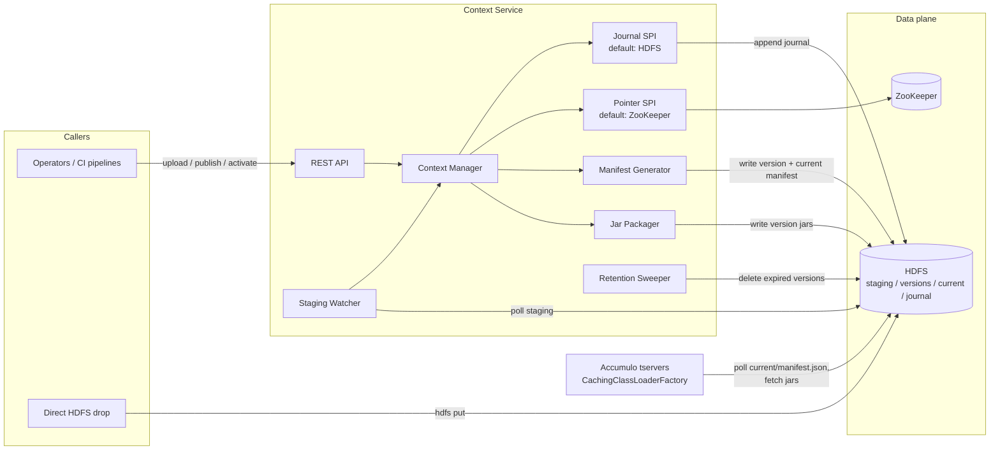

# Context Service — High-Level Design

**Status:** Draft for review
**Repo:** `datawave-file-provider-service` (the service described here is referred to as the *Context Service*)
**Related:** [Accumulo classloaders][accumulo-classloaders], [Datawave Spring Boot starter][datawave-starter], [design prompt](hld-prompt.md)

---

## 1. Purpose

The Context Service manages **Accumulo classloader contexts**: named, versioned sets of JAR files stored in HDFS and consumed by Accumulo's `CachingClassLoaderFactory` ([accumulo-classloaders][accumulo-classloaders]). It provides:

- **Context management and awareness** — which contexts exist, what files/versions they contain, and which version is current.
- **Auto-detection of new files** — files uploaded to a context are detected, packaged, and rolled into a new context version without manual manifest editing.
- **Context pointer management** — an authoritative, SPI-driven record of the *current* version of each context (ZooKeeper by default), projected into the manifest file the Accumulo classloader polls.
- **An observable audit trail** — every context change is recorded in a durable, append-only journal in HDFS (SPI-driven) and exposed via the REST API.

### 1.1 Background: how the Accumulo classloader consumes a context

The design is driven by the contract of `CachingClassLoaderFactory` (the current, supported implementation in [accumulo-classloaders][accumulo-classloaders]; the older VFS/reloading classloader was removed upstream):

- A context, from Accumulo's point of view, **is a URL to a JSON manifest** (`table.class.loader.context=<manifest URL>`). The manifest lists resources, each with a `location` URL, a digest `algorithm`, and a `checksum`, plus a `monitorIntervalSeconds`.
- Every resource **must be a JAR** (jar/war/ear). Loose files (properties, config, data) must be packaged inside a JAR to be loadable via `getResourceAsStream()`.
- The classloader **polls the manifest URL** every `monitorIntervalSeconds` and rebuilds its classloader when the manifest content (SHA-512 of the normalized JSON) changes. Replacing the manifest content at a stable URL is the upstream-designed rollout mechanism.
- The classloader caches each resource locally keyed by **filename + checksum** (the manifest's URL+checksum pair identifies the resource, but the local cache file name embeds only filename and checksum). Two consequences: published content must be immutable (never change bytes under an already-published URL+checksum), and an unchanged file republished under a new versioned URL with the same filename and checksum is **not re-downloaded** by tservers.
- The classloader supports `file:` and `http(s):` URLs natively; `hdfs:` URLs additionally require the `hdfs-urlstreamhandler-provider` jar on Accumulo's classpath. All URLs must match the Accumulo-admin-controlled `general.custom.classloader.ccl.allowed.urls.pattern`.

The classloader has **no notion of versions, history, or a "current" pointer** — that is exactly the gap this service fills.

### 1.2 Control plane, not data plane

A deliberate, simplicity-driven decision: **Accumulo never reads from this service.** All URLs in generated manifests are `hdfs:` URLs, and the stable manifest that Accumulo polls lives in HDFS. The Context Service is a control plane that writes to HDFS; HDFS is the data plane. Consequences:

- The service being down never breaks class loading — Accumulo keeps polling HDFS.
- No file-streaming endpoints, no serving-capacity planning for `N tservers × M contexts` polling traffic.
- The Accumulo classloader context (the manifest + files in HDFS) remains the **source of truth for the actual files**, per the design guidance. The service's own declarative manifest (§4.1) is an instruction set, not a replacement.

## 2. Goals and non-goals

### Goals

1. Create/list/inspect contexts via REST API.
2. Accept file uploads into a context and auto-detect files dropped directly into HDFS staging.
3. Package non-JAR files into a generated JAR; publish immutable, versioned context snapshots to HDFS.
4. Generate the Accumulo classloader manifest for each version and atomically project the current version's manifest to the stable URL Accumulo polls.
5. Maintain the current-version pointer behind an SPI, with a ZooKeeper implementation as the default.
6. Record every mutating operation in an SPI-driven audit journal (HDFS-backed by default) and expose it via API.
7. Enforce a configurable retention policy that cleans up old version directories in HDFS (§5.7).
8. Operate as a standard Datawave microservice (starter security, config server, Consul discovery).

### Non-goals (YAGNI — revisit only when a real need appears)

- **Serving JARs/manifests over HTTP to Accumulo** — HDFS is the data plane (§1.2).
- **Accumulo-side setup.** Three one-time Accumulo-admin actions are prerequisites, not service responsibilities: set `table.class.loader.context` on each table to the context's stable manifest URL; deploy the `hdfs-urlstreamhandler-provider` jar on the Accumulo classpath (required for `hdfs:` URLs); set `general.custom.classloader.ccl.allowed.urls.pattern` to cover the context root (e.g. `hdfs://namenode:8020/datawave/contexts/.*`).
- **A database.** State lives in HDFS (files, versions, manifests, audit journal) and ZooKeeper (pointer). The service holds only caches rebuilt from those.
- **Multi-instance coordination / leader election.** Single service instance initially; §9 sketches the upgrade path.
- **Dependency/conflict analysis of uploaded JARs**, virus scanning, jar signing.
- **Poison-file handling** — quarantining/rejecting files that repeatedly fail packaging or publishing. Deliberately deferred to a later discussion (§5.6 notes the hook point); until then a bad file simply keeps the pending set unpublishable, which the publish error surfaces.
- **Messaging/eventing on context changes** (Spring Cloud Bus broadcast) — consumers poll HDFS via the classloader already.

## 3. Architecture overview



Components (all inside the single `service` module — these are classes/packages, not separate deployables):

| Component | Responsibility |
|---|---|
| **REST API** | CRUD-ish operations on contexts, upload, publish/activate, audit query. Secured by starter JWT security. |
| **Context Manager** | Orchestrates the lifecycle: staging → version → publish → activate. Owns the in-memory view of contexts, rebuilt from HDFS on startup. |
| **Staging Watcher** | Polls each context's HDFS staging directory for completed uploads (§5.2); feeds the Context Manager. |
| **Jar Packager** | Wraps loose (non-JAR) files into a single generated JAR per version. Uploaded JARs pass through untouched. |
| **Manifest Generator** | Computes checksums and emits the Accumulo classloader manifest JSON for a version; atomically projects the current version's manifest to the stable path. |
| **Pointer SPI** | `ContextPointerStore` interface; default `ZookeeperContextPointerStore` (Curator). Authoritative "current version" per context. |
| **Journal SPI** | `AuditJournalStore` interface; default `HdfsAuditJournalStore` (JSON-lines files in HDFS). Append-only ledger of context events; single writer (§7.2). |
| **Retention Sweeper** | Periodically deletes version directories that fall outside the configured retention policy (§5.7); never touches the active version. |

New dependencies beyond the Datawave starter: `hadoop-client` (HDFS), `curator-framework`/`curator-recipes` (the starter has no ZooKeeper/Curator utility to reuse — only Accumulo's own client wiring).

## 4. Data model

### 4.1 Context configuration manifest (declarative input)

Per design guidance, a **manifest of configured files is the declarative instruction** for what the service manages per context. It lives in the service's Spring configuration (config server → `fileprovider.yml`), keeping it versioned and reviewable through the existing config-repo workflow — no new storage mechanism:

```yaml
file-provider:
  hdfs:
    uri: hdfs://namenode:8020
    root: /datawave/contexts
  retention:                    # defaults, overridable per context
    keep-min-versions: 5        # never drop below this many, regardless of age
    keep-for: 30d               # versions older than this are eligible for GC
    sweep-interval: 6h          # how often the Retention Sweeper runs
  contexts:
    - name: analytics
      monitor-interval-seconds: 30
      retention:
        keep-for: 90d           # per-context override
      # which staged files belong to this context
      include:
        - pattern: "*.jar"          # passed through as-is
        - pattern: "*.properties"   # packaged into the generated jar
        - pattern: "*.xml"
    - name: edge
      monitor-interval-seconds: 60
      include:
        - pattern: "*.jar"
```

This manifest declares *intent* (which contexts exist, which files are eligible, how they are classified). The published Accumulo manifest + files in HDFS remain the source of truth for what is actually being served.

Duration-valued properties (`keep-for`, `sweep-interval`) use Spring's readable duration syntax (`30d`, `6h`, `45m`) so the config reads as policy, not magic numbers.

### 4.2 HDFS layout (system of record for files)

```
/datawave/contexts/<context>/
├── staging/                          # incoming files (mutable)
│   └── my-iterators.jar
├── versions/                         # immutable once written
│   ├── 20260811T1432Z/
│   │   ├── my-iterators.jar
│   │   ├── context-files.jar         # generated jar wrapping loose files
│   │   └── manifest.json             # Accumulo classloader manifest for this version
│   └── 20260812T0910Z/
│       └── ...
├── current/
│   └── manifest.json                 # stable URL polled by Accumulo (atomic overwrite)
└── journal/                          # append-only audit journal, JSON lines (§7.2)
    └── 2026-08.jsonl                 # rolled monthly
```

- **Version IDs are UTC timestamps** (`yyyyMMdd'T'HHmm'Z'`, plus a disambiguating suffix on collision). This satisfies the "date convention" guidance: versions sort chronologically, and "which is newer" is self-evident to a human browsing HDFS.
- `versions/**` is **immutable**: never rewritten, honoring the classloader's immutability rule (§1.1). Manifests for version N reference `hdfs://…/versions/<version>/<file>` URLs. Each version directory is a self-contained full copy of its files; because tservers cache by filename+checksum, unchanged files carried into a new version cost no tserver re-downloads.
- `current/manifest.json` is the **only mutable published path**. Activation writes the new manifest to a temp file and atomically replaces the old one — note the plain `FileSystem.rename(src, dst)` returns `false` when `dst` exists; the implementation must use `FileContext.rename(src, dst, Options.Rename.OVERWRITE)`, which is atomic per the HDFS spec. Accumulo tables are configured once with `table.class.loader.context=hdfs://…/<context>/current/manifest.json`.
- **Supersede contract:** the logical identity of a file is its **exact filename**. A staged file with the same name as one in the previous version supersedes it; latest version of the context wins. Uploaders MUST therefore use stable filenames (`my-iterators.jar`, not `my-iterators-1.3.jar`) — version-stamped names would silently accumulate side-by-side and put duplicate classes on the classpath. As a guard, publish warns (or rejects, configurable) when the pending set contains near-duplicate artifact names (same maven-style prefix, different version suffix). Removal is an explicit API call (§6), not file-deletion detection.

### 4.3 Accumulo manifest (generated output)

Exactly the upstream `CachingClassLoaderFactory` format — the service generates it, never hand-edited:

```json
{
  "comment": "context=analytics version=20260811T1432Z published-by=cn=deployer,...",
  "monitorIntervalSeconds": 30,
  "resources": [
    { "location": "hdfs://namenode:8020/datawave/contexts/analytics/versions/20260811T1432Z/my-iterators.jar",
      "algorithm": "SHA-256",
      "checksum": "ed95fe13..." },
    { "location": "hdfs://namenode:8020/datawave/contexts/analytics/versions/20260811T1432Z/context-files.jar",
      "algorithm": "SHA-256",
      "checksum": "958f12dd..." }
  ]
}
```

Generation rules: deterministic resource ordering (stable classpath precedence and stable manifest checksums), SHA-256 digests, `comment` carries provenance for humans debugging on the Accumulo side.

## 5. Key flows

### 5.1 Upload via API (primary path)

1. `PUT /v1/context/{name}/file/{filename}` (streamed body). Files not matching the context's configured `include` patterns are rejected immediately (HTTP 400). Accepted files are streamed to `staging/` in HDFS via a temp-name + atomic rename.
2. Because the upload is an API call, **completion is unambiguous** — the HTTP request finishing is the completion signal. No advice parameters needed.
3. The upload is audited (who, what, checksum, size) and the file becomes part of the context's *pending* change set.

### 5.2 Direct HDFS drop (auto-detection path)

Callers with HDFS access (e.g., existing deployment pipelines) may `hdfs dfs -put` directly into `staging/`. The Staging Watcher polls each staging directory (configurable interval, default 30s) and must decide when a file is *finished* being written. Convention, in order of preference:

1. **Rename convention (primary):** writers upload to a temp name and rename on completion — `hdfs dfs -put` already does this natively, writing to `<name>._COPYING_` and renaming when done. The watcher ignores names matching `*._COPYING_` (and dot-prefixed names, for writers using that convention). The completed rename makes the finished file visible atomically.
2. **Quiescence check (safety net):** a candidate file is accepted only after its length and modification time are unchanged across two consecutive polls. (Caveat: an open HDFS write stream doesn't advance length/mtime predictably until block boundaries or close, so a stalled writer can pass this check — the rename convention is the real guarantee; quiescence only narrows the window for non-conforming writers.)

This means the common tooling (`hdfs dfs -put`) is safe by default with no writer-side changes. Detected files matching the context's `include` patterns are audited (`principal=hdfs-autodetect`) and join the pending change set; non-matching files are quarantined at detection (listed in context detail, never published).

**Trust boundary:** API uploads are JWT-authenticated; direct drops are authenticated only by HDFS permissions on `staging/` — those directory ACLs *are* the security boundary for this path, and the published code ultimately executes inside tservers. The mitigating control is the explicit publish gate: context detail and the publish response list every pending file with checksum and provenance (uploader principal vs. `hdfs-autodetect`), so the approver reviews exactly what will ship.

### 5.3 Publish + activate

Publishing turns the pending change set into a new immutable version; activation moves the pointer. **By default one API call does both** — the split exists so a staged rollout (publish now, activate later) is possible without new machinery.

1. `POST /v1/context/{name}/publish` (optional `activate=false`, default `true`). Publishing with an empty pending change set is a no-op error (HTTP 409) — identical duplicate versions are never created.
2. Context Manager assembles the version file set: previous version's files, overlaid with pending staged files (filename-based supersede per §4.2, with the near-duplicate-name guard), minus explicitly removed names.
3. Jar Packager copies JARs into `versions/<v>/` and packages loose files into `context-files.jar` (deterministic entry order/timestamps so identical inputs produce identical checksums).
4. Manifest Generator computes checksums, writes `versions/<v>/manifest.json`.
5. If activating: Pointer SPI `setCurrent(context, v)` (ZooKeeper), then the manifest is atomically projected to `current/manifest.json`. Order matters — pointer first, projection second; §5.5 covers crash recovery.
6. Staged files that made it into the version are cleared from `staging/` — matched by name **and** the checksum captured at assembly time, so a file re-uploaded mid-publish is left in staging as pending rather than silently destroyed. This clear is deliberately the **last** step: a failure anywhere earlier leaves staging intact, which is the safety latch that makes publish failures recoverable (§5.6). Every step is audited.
7. Within `monitorIntervalSeconds`, every tserver polling `current/manifest.json` sees the changed content and swaps in the new classloader.

All mutating operations on a context (`publish`, `activate`, `remove`, staging cleanup) are **serialized through a per-context in-process lock** in the Context Manager — trivially correct because the service is single-instance (§2); the §9 leader-election upgrade preserves exactly this invariant across instances.

There is **no auto-publish**: detection is automatic, publication is a deliberate human/CI action. This keeps "files are still arriving" races out of scope — the publisher decides when the set is complete. (An optional quiescence-based auto-publish can be layered on later if operations want it.)

### 5.4 Rollback

`POST /v1/context/{name}/activate?version=<v>` re-points to any retained version: pointer update + manifest re-projection. Because versions are immutable and tservers cache resources by filename+checksum (§1.1), rolling back to a previously seen version triggers **zero jar downloads** on tservers — only the small manifest re-fetch.

### 5.5 Startup reconciliation

On startup (and on a `POST /v1/context/{name}/reconcile`), the service compares, per context: the pointer (ZooKeeper) vs. `current/manifest.json` (HDFS) vs. `versions/` (HDFS). Rules:

- **Pointer present, projection disagrees** (e.g., crash between pointer write and projection): the pointer is authoritative — re-project `current/manifest.json` and audit the repair.
- **Pointer absent, projection exists** (fresh/rebuilt ZooKeeper, or first deployment over pre-existing HDFS state): **adopt** — seed the pointer from the version the projection matches and audit the adoption. Never delete or rewrite a valid `current/manifest.json` because the pointer is missing; the running Accumulo cluster is depending on it.
- **Both absent**: the context has never been activated; nothing to do.

This is the entire consistency story — no distributed transactions.

- **Incomplete version directory** (crash mid-publish): a `versions/<v>/` directory without a `manifest.json` is by definition unfinished (§5.6 writes the manifest last as the completion marker). Reconciliation deletes it and audits the cleanup; the staged inputs are still in `staging/`, so the next publish simply redoes the work.

### 5.6 Failure handling: file onboarding and publish

The design principle is **staging is the safety latch**: a file is removed from `staging/` only after it is durably part of a published version (§5.3 step 6). Every failure mode below resolves to "the file is still in staging, pending, and visible in context detail" — nothing is silently lost, and no separate `processing/` directory is needed. A processing folder was considered and rejected: it only helps when the consumer *moves* files before working on them, but publish reads staged files in place and copies them into the immutable version directory, so there is never a window where staging is the only copy of half-consumed work.

Failure modes and responses:

- **Transient HDFS errors** (temporary `IOException`, `SafeModeException`, DataNode churn) during upload, detection, or publish: bounded retries with exponential backoff (`file-provider.hdfs.retry.attempts`, default 3; `retry.backoff`, default `2s`, readable duration). Uploads that exhaust retries fail the HTTP request — the client's completion signal is honest, and the temp-name write never becomes visible as a staged file.
- **Publish fails mid-flight** (packaging error, checksum failure, HDFS write error after retries): the operation aborts with an error response and an audited `PUBLISH_FAILED` event. Version files are assembled under `versions/<v>/` with `manifest.json` written **last** as the completion marker, so an aborted publish leaves at worst an incomplete directory that reconciliation (§5.5) removes. Staging is untouched, so the pending set is picked up again by the next publish attempt — no re-upload, no processing folder, no manual recovery.
- **Activation fails after pointer write** (crash between ZooKeeper update and manifest projection): already covered by reconciliation (§5.5) — the pointer is authoritative and the projection is repaired.
- **Staging Watcher errors** (listing failure, unreadable file): logged and retried on the next poll cycle; detection is idempotent, so a file is either not yet pending (retried) or already pending (no-op).
- **Poison files** — a file that *deterministically* fails packaging or publishing would be retried on every publish attempt indefinitely. Automatic quarantine/poison handling is **deliberately deferred** (§2 non-goals) pending a later discussion; for now the publish error message names the offending file and the operator removes it via `DELETE .../file/{filename}` or directly from staging. The retry/latch design above is the natural hook point when poison handling is added.

### 5.7 Version retention / GC

Old version directories accumulate in HDFS (each is a self-contained full copy, §4.2). The **Retention Sweeper** enforces the operator-configured policy from §4.1 (`retention.keep-min-versions`, `retention.keep-for`, `retention.sweep-interval` — readable durations, per-context overridable):

1. Each sweep, per context, versions are considered for deletion **oldest first**. A version is deleted only if it is older than `keep-for` **and** more than `keep-min-versions` versions would remain — both conditions, so a quiet context keeps its history and a busy one still gets bounded growth.
2. **Hard guards, regardless of policy:** the currently active version (per the pointer) is never deleted, and neither is any version *newer* than the active one (it may be a staged rollout awaiting activation, §5.3).
3. Each deletion is journaled (`GC` action, listing the version and files removed). Rollback (§5.4) is thereby explicitly bounded by retention: only retained versions are rollback targets, and the version list in context detail shows exactly what is retained.
4. The audit journal itself is **not** GC'd — it is small (one JSON line per event) and is the durable history that outlives the versions it describes.

tserver-side there is nothing to coordinate: deleting a version that is not (and never again will be) referenced by any manifest only removes files no classloader will fetch; already-cached jars on tservers age out under the classloader's own cache management.

## 6. REST API sketch

All endpoints under the standard Datawave security model (JWT bearer auth from the starter). Reads require an authorized-user role; mutations require a manager/admin role (`@PreAuthorize`, exact role names per deployment convention).

| Method & path | Purpose |
|---|---|
| `GET  /v1/contexts` | List contexts with current version + summary. |
| `GET  /v1/context/{name}` | Detail: current version, pending staged files, version list, file inventory. |
| `PUT  /v1/context/{name}/file/{filename}` | Upload a file into staging (streamed body; idempotent by name). |
| `DELETE /v1/context/{name}/file/{filename}` | Mark a logical file for removal in the next published version. |
| `POST /v1/context/{name}/publish` | Create a new version from pending changes; `activate` param (default `true`). |
| `POST /v1/context/{name}/activate?version=v` | Point the context at an existing version (rollback/roll-forward). |
| `GET  /v1/context/{name}/manifest` | Convenience: return the currently projected Accumulo manifest. |
| `GET  /v1/context/{name}/audit` | Audit trail query (`from`, `to`, `limit`). |
| `POST /v1/context/{name}/reconcile` | Force pointer↔HDFS reconciliation (§5.5). |

Contexts themselves are created/removed via the declarative configuration manifest (§4.1), not the API — context creation is an infrastructure decision that belongs in the reviewed config repo.

Responses use the Datawave `BaseResponse`/`VoidResponse` envelope conventions; API DTOs live in the `api` module so other services/CLIs can depend on them.

## 7. SPI definitions

Both SPIs are Spring-managed: implementations are beans, selection is by configuration property. "SPI" here means a small stable Java interface in the `api` module — not `ServiceLoader` ceremony.

### 7.1 Context pointer

```java
public interface ContextPointerStore {
    Optional<ContextPointer> getCurrent(String context);
    void setCurrent(String context, ContextPointer pointer);   // version + who + when
}
```

**Default: ZooKeeper** (`file-provider.pointer.type=zookeeper`), via Curator against the same ZooKeeper quorum Accumulo already runs — no new infrastructure. Pointer state is a small JSON blob at `/datawave/context-service/pointers/<context>`. ZooKeeper gives atomic pointer swaps, durability independent of the service, and lets other tooling watch pointer changes for free.

Why a pointer store at all, when `current/manifest.json` also encodes "current"? The HDFS file is a *projection* for the classloader (which can only poll a URL); the pointer is the *authoritative record* (with metadata: who activated, when, from what version) that survives a botched projection and drives reconciliation (§5.5). A future `HdfsContextPointerStore` (pointer file in HDFS) is an easy second implementation for deployments that want zero ZooKeeper coupling.

### 7.2 Audit journal

```java
public interface AuditJournalStore {
    void append(ContextAuditEvent event);
    List<ContextAuditEvent> query(String context, AuditQuery query);
}
```

`ContextAuditEvent`: timestamp, context, action (`UPLOAD`, `DETECT`, `REMOVE`, `PUBLISH`, `PUBLISH_FAILED`, `ACTIVATE`, `RECONCILE`, `GC`), principal (from the JWT proxy chain, or `hdfs-autodetect`), version, files affected (name/size/checksum), free-form detail.

**Default: HDFS** (`file-provider.audit.type=hdfs`) — an append-only JSON-lines journal per context at `<context>/journal/<yyyy-MM>.jsonl` (§4.2), one line per event, files rolled monthly. This is an **audit view with durable state**, not a transaction log: the service is the single writer (single instance, §2; the §9 leader-election upgrade preserves single-writer), so plain HDFS create/append semantics suffice — no locking, no compare-and-swap. Rationale:

- No new infrastructure and no database: the journal lives in the same HDFS the service already writes, inherits HDFS replication for durability, and survives service redeploys with no persistent-volume requirement on the service itself.
- Independently observable: `hdfs dfs -cat .../journal/2026-08.jsonl` gives an operator the full history with standard tooling, even if the service is down.
- Rebuildable reads: the API query (`GET .../audit`) reads through the SPI; the service keeps no other copy.

**S3 variant** (`file-provider.audit.type=s3`) for deployments on object storage: S3 has no append, so the store writes one small object per event (`journal/<timestamp>-<action>.json`) — key order preserves time order, and a query is a prefix listing. Same interface, same single-writer assumption.

Note this journal is a *context-change ledger*, deliberately distinct from Datawave's `spring-boot-starter-datawave-audit` / `AuditClient`, which is query-execution-shaped and requires the audit microservice; it was evaluated and does not fit file-lifecycle events. If a deployment later wants those events forwarded there too, that is one more `AuditJournalStore` implementation.

## 8. Microservice integration

Follows the established Datawave microservice template (this repo already conforms):

- **Modules:** `api` (DTOs + SPI interfaces, consumable by clients) and `service` (Spring Boot app), parents `datawave-microservice-parent` / `datawave-microservice-service-parent`.
- **Starter:** `spring-boot-starter-datawave` provides JWT/PKI security, proxied-entity chains, method security, metrics, Undertow, exception handling — nothing security-related is built here.
- **Config:** `spring.application.name=fileprovider`; declarative context manifest and all `file-provider.*` properties come from the config server (`fileprovider.yml`), so context definitions are change-controlled in the config repo. `@RefreshScope`d so config-repo changes to the context list are picked up without restart.
- **Discovery:** Consul via `@EnableDiscoveryClient` (already in place).
- **Health/observability:** actuator health indicators for HDFS reachability, ZooKeeper connectivity, and journal writability; DropWizard metrics via the starter for upload/publish counts and durations, plus retention-sweep results.

## 9. Future considerations (explicitly deferred)

- **HA / multiple instances:** add Curator leader election so only the leader runs the Staging Watcher and publish operations (the pieces — Curator, ZooKeeper — are already in the stack). Reads scale horizontally without it.
- **HTTP data plane:** if a deployment cannot give tservers HDFS access to the context tree, add manifest/jar serving endpoints; the classloader supports `http(s):` (full-GET polling, no conditional requests — capacity math required).
- **Poison-file quarantine** (§5.6) — automatic detection and sidelining of files that deterministically fail publish; deferred to a later discussion.
- Quiescence-based auto-publish, Spring Cloud Bus change notifications, per-file supersede rules richer than name-based (e.g., date-stamped logical names).
- **Cache hygiene tooling:** upstream classloader caches don't self-heal corrupted local files; an ops runbook (using upstream's `init-classloader-cache-dir -v`) belongs in operational docs.

## 10. Design decisions summary

| Decision | Choice | Why |
|---|---|---|
| Data plane | HDFS only; service is control plane | Classloader keeps working when service is down; no serving capacity concerns; honors "HDFS is source of truth" |
| Manifest strategy | Immutable versioned manifests + atomic projection to one stable URL | Matches upstream's designed rollout mechanism; satisfies URL+checksum immutability rule |
| Version identity | UTC timestamp IDs, immutable self-contained version dirs | Date-convention guidance; human-legible in HDFS; zero-download rollback |
| Supersede rule | Exact-filename identity, stable names required, near-duplicate guard at publish | Simplest correct rule; guard catches the version-stamped-name foot-gun |
| Upload completion | API = request completion; HDFS drop = `*._COPYING_` rename convention + quiescence | No writer-side protocol needed; `hdfs dfs -put` is already safe |
| Publish trigger | Explicit API call (auto-detect stages, humans publish) | Avoids publishing half-arrived file sets; simplest correct behavior |
| Pointer store | SPI, ZooKeeper default (Curator) | Guidance; ZK already deployed for Accumulo; atomic + watchable |
| Audit store | SPI, HDFS JSON-lines journal default (single writer; S3 per-event-object variant) | No DB and no new infrastructure; durable via HDFS replication; observable with standard tooling; API-exposed |
| Onboarding failures | Bounded HDFS retries; staging cleared only after successful publish (safety latch); `manifest.json` written last as completion marker | Failures leave files pending, not lost; no `processing/` dir needed; poison handling deferred |
| Retention/GC | Sweeper with readable config (`keep-min-versions`, `keep-for`, `sweep-interval`); active + newer versions never deleted | Bounded HDFS growth; operator-legible policy; rollback window is explicit |
| State/database | None — HDFS + ZK only | YAGNI; service is rebuildable from its stores |
| Instances | Single instance initially | YAGNI; leader election is a known, deferred upgrade |

[accumulo-classloaders]: https://github.com/apache/accumulo-classloaders
[datawave-starter]: https://github.com/NationalSecurityAgency/datawave-spring-boot-starter
